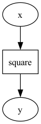

# `pdag` — Parameter Directed Acyclic Graph

[](https://pypi.org/project/pdag/)


[](https://github.com/shunichironomura/pdag/actions)
[](https://codecov.io/gh/shunichironomura/pdag)
[](https://github.com/astral-sh/uv)
[](https://github.com/astral-sh/ruff)


> [!WARNING]
> This package is under development. Many features are already implemented, but expect some breaking changes in the future.

---

Documentation: <https://shunichironomura.github.io/pdag/>

Source code: <https://github.com/shunichironomura/pdag>

---

`pdag` helps you create and execute a directed acyclic graph (DAG) of parameters and their relationships.
Its features include:

- You can define parameters and their dependencies with a Python's class-based syntax and annotations.
- You can import another model into your model, allowing you to create a hierarchy of models and reuse them.
- You can use the `pdag watch` command to watch the graph representation of your model while you are creating it.

## Installation

```bash
pip install pdag
```

or any package manager that supports Python packages.

## Basic usage

Here is a simple example of how to use `pdag` to create a model that squares a number:

```python
from typing import Annotated
import pdag

class SquareModel(pdag.Model):
    """Square model that squares a number."""

    # x is a real number parameter and is the input to the model
    x = pdag.RealParameter("x")

    # y is a real number parameter and is the output of the model
    y = pdag.RealParameter("y")

    # The relationship is defined as a static method
    # with the @pdag.relationship decorator
    @pdag.relationship
    @staticmethod
    def square(
      # The annotation `x.ref()` indicates that the value of `x` will be provided
      # as the value of the `x_arg` parameter when the model is executed.
      # Note that we use `x_arg` as the name of the argument for documentation purposes,
      # but in practice, you can just use `x` as the name of the argument.
      x_arg: Annotated[float, x.ref()],

      # The annotation `y.ref()` indicates that the return value of the method
      # will be assigned to the `y` parameter when the model is executed.
    ) -> Annotated[float, y.ref()]:
        return x_arg**2
```

This `SquareModel` is a static model with input `x` and output `y`.
Here is the graph representation of the model:



You can test it by running the following command in the virtual environment where you installed `pdag`:

```bash
pdag watch pdag.examples.square:SquareModel square.png
```

To execute the model for a specific value of `x`, execute the following code:

```python
core_model = SquareModel.to_core_model()
exec_model = pdag.create_exec_model_from_core_model(core_model)
results = pdag.execute_exec_model(
    exec_model,
    inputs={
        # `()` indicates the root model, and `"x"` is the name of the parameter.
        pdag.StaticParameterId((), "x"): 2.0,
    },
)

print(results)
# {
#   StaticParameterId(model_path=(), name='x'): 2.0,
#   StaticParameterId(model_path=(), name='y'): 4.0,
# }
```

## Parameter and collection types

`pdag` supports the following parameter types:

- `pdag.RealParameter`: A real number parameter.
- `pdag.BooleanParameter`: A boolean parameter.
- `pdag.CategoricalParameter`: A categorical parameter.

and the following parameter collection types:

- `pdag.Array`: An array of `pdag` parameters.
- `pdag.Mapping`: A dictionary of `pdag` parameters.

Here is an example of how to use these parameter types and collections:

```python
from typing import Annotated
import numpy as np
import pdag

class ModelWithVariousTypes(pdag.Model):
    """Model that uses different parameter types and collections."""

    # x is a real number parameter
    x = pdag.RealParameter("x")

    # y is a boolean parameter
    y = pdag.BooleanParameter("y")

    # z is a categorical parameter with three possible values
    z = pdag.CategoricalParameter("z", ("a", "b", "c"))

    # a is an array of real number parameters with two elements
    # Each parameter's name is automatically generated as "a[0]" and "a[1]"
    a = pdag.Array("a", np.array([pdag.RealParameter(...) for _ in range(2)]))

    # m is a dictionary of real number parameters
    # Each parameter's name is automatically generated as "m[a]", "m[b]", and "m[c]"
    m = pdag.Mapping("m", {k: pdag.RealParameter(...) for k in ["a", "b", "c"]})

    @pdag.relationship
    @staticmethod
    def my_relationship(
        y_arg: Annotated[bool, y.ref()],
        z_arg: Annotated[str, z.ref()],
        a_arg: Annotated[list[float], a.ref()],
        m_arg: Annotated[Mapping[str, float], m.ref()],
    ) -> Annotated[float, x.ref()]:
        if y_arg:
            return m_arg[z_arg] * a_arg[1] + a_arg[0]
        else:
            return 0.0
```

## Define relationships in a for loop

`pdag` allows you to define relationships in a for loop. This is useful, for example, when you want to define a relationship for each element of a mapping.

In the following example, we define a `EachSquaredModel` that calculates the square of each element of a mapping `m`:

```python
from typing import Annotated
import numpy as np
import pdag

class EachSquaredModel(pdag.Model):
    """EachSquaredModel model that uses a mapping of parameters."""

    m = pdag.Mapping("m", {k: pdag.RealParameter(...) for k in ("a", "b", "c")})
    m_squared = pdag.Mapping("m_squared", {k: pdag.RealParameter(...) for k in ("a", "b", "c")})

    for k in ("a", "b", "c"):
        # You need to provide the identifier to distinguish each relationship
        @pdag.relationship(identifier=k)
        @staticmethod
        def square(
            # The annotation `m.ref(k)` indicates that the value of `m[k]` will be provided
            # when the model is executed.
            m_arg: Annotated[float, m.ref(k)],

            # The annotation `m_squared.ref(k)` indicates that the return value of the method
            # will be assigned to `m_squared[k]` when the model is executed.
        ) -> Annotated[float, m_squared.ref(k)]:
            return m_arg**2
```

## Dynamic models

`pdag` supports dynamic models, where you can define time-series parameters and dynamic relationships between them.

In the following example, we define a `DiamondMdpModel` that simulates a Markov Decision Process (MDP) with a diamond-shaped state space:

```python
from typing import Annotated, Literal

import pdag


class DiamondMdpModel(pdag.Model):
    """Diamond MDP model."""

    # The policy parameter is the policy of the agent,
    # and it is a categorical parameter with two possible values.
    # It is NOT a time-series parameter.
    policy = pdag.CategoricalParameter("policy", categories=("left", "right"))

    # The location parameter is the state of the MDP.
    # You need to provide the `is_time_series=True` argument
    # to indicate that this parameter is a time-series parameter.
    location = pdag.CategoricalParameter(
        "location",
        categories=("start", "left", "right", "end"),
        is_time_series=True
    )

    # The action parameter is the action taken by the agent,
    # and it is also a time-series parameter.
    action = pdag.CategoricalParameter(
        "action",
        categories=("go_left", "go_right", "move_forward", "none"),
        is_time_series=True,
    )

    # The reward parameter is the reward received by the agent,
    # and it is also a time-series parameter.
    reward = pdag.RealParameter("reward", is_time_series=True)

    # The cumulative_reward parameter is the cumulative reward received by the agent,
    # and it is NOT a time-series parameter.
    cumulative_reward = pdag.RealParameter("cumulative_reward")

    # For relationsihps that should be calculated at each time step,
    # you need to provide the `at_each_time_step=True` argument
    @pdag.relationship(at_each_time_step=True)
    @staticmethod
    def action_selection(
        *,
        # The value of `policy` is provided as the value of the `policy` parameter
        policy: Annotated[Literal["left", "right"], policy.ref()],

        # The value of `location` at the current time step is provided as the value of the `location` parameter
        location: Annotated[Literal["start", "left", "right", "end"], location.ref()],

        # The return value of the method is assigned to the `action` parameter
        # at the current time step.
    ) -> Annotated[Literal["go_left", "go_right", "move_forward", "none"], action.ref()]:
        match location, policy:
            case "start", "left":
                return "go_left"
            case "start", "right":
                return "go_right"
            case "left", "left":
                return "move_forward"
            case "left", "right":
                return "go_right"
            case "right", "right":
                return "move_forward"
            case "right", "left":
                return "go_left"
            case "end", _:
                return "none"

        msg = f"Invalid policy and location combination: {policy=}, {location=}"
        raise ValueError(msg)

    @pdag.relationship(at_each_time_step=True)
    @staticmethod
    def state_transition(
        *,
        location: Annotated[Literal["start", "left", "right", "end"], location.ref()],
        action: Annotated[Literal["go_left", "go_right", "move_forward", "none"], action.ref()],

        # By providing `next=True`, you can indicate that the return value of the method
        # will be assigned to the `location` parameter at the next time step.
    ) -> Annotated[Literal["start", "left", "right", "end"], location.ref(next=True)]:
        match location, action:
            case "start", "go_left":
                return "left"
            case "start", "go_right":
                return "right"
            case "start", "move_forward":
                return "start"
            case "left", "move_forward":
                return "end"
            case "left", "go_left":
                return "left"
            case "left", "go_right":
                return "right"
            case "right", "move_forward":
                return "end"
            case "right", "go_left":
                return "left"
            case "right", "go_right":
                return "right"
            case _, "none":
                return location
            case "end", _:
                return "end"

        msg = f"Invalid location and action combination: {location=}, {action=}"
        raise ValueError(msg)

    @pdag.relationship
    @staticmethod
    def initial_reward(
      # By providing `initial=True`, you can indicate that the return value of the method
      # will be assigned to the `reward` parameter at the initial time step.
    ) -> Annotated[float, reward.ref(initial=True)]:
        return 0.0

    @pdag.relationship(at_each_time_step=True)
    @staticmethod
    def reward_function(
        *,
        previous_location: Annotated[
            Literal["start", "left", "right", "end"],
            # `previous=True` indicates that the value of the `location` parameter
            # at the previous time step will be provided as the value of the `previous_location` parameter.
            location.ref(previous=True),
        ],
        action: Annotated[
            Literal["go_left", "go_right", "move_forward", "none"],
            # `previous=True` indicates that the value of the `action` parameter
            # at the previous time step will be provided as the value of the `action` parameter.
            action.ref(previous=True),
        ],
        location: Annotated[Literal["start", "left", "right", "end"], location.ref()],
    ) -> Annotated[float, reward.ref()]:
        if previous_location != "end" and location == "end":
            return 1.0
        return 0.0

    @pdag.relationship
    @staticmethod
    def cumulative_reward_calculation(
        *,
        # `all_time_steps=True` indicates that the value of the `reward` parameter
        # at all time steps will be provided as the value of the `reward` parameter.
        reward: Annotated[list[float], reward.ref(all_time_steps=True)],
    ) -> Annotated[float, cumulative_reward.ref()]:
        return sum(reward)
```

## Importing models

`pdag` allows you to import another model into your model.

In the following example, we define a `SquareModel` that squares a number and a `PolynomialModel` that uses the `SquareModel` to calculate the square term of a polynomial:

```python
from typing import Annotated
import pdag

class SquareModel(pdag.Model):
    """Square model that squares a number."""

    x = pdag.RealParameter("x")
    y = pdag.RealParameter("y")

    @pdag.relationship
    @staticmethod
    def square(
      x_arg: Annotated[float, x.ref()],
    ) -> Annotated[float, y.ref()]:
        return x_arg**2

class PolynomialModel(pdag.Model):
    """Polynomial model that calculates y = a[0] + a[1] * x + a[2] * x^2."""

    a = pdag.Array("a", np.array([pdag.RealParameter(...) for _ in range(3)]))
    x = pdag.RealParameter("x")
    x_squared = pdag.RealParameter("x_squared")
    y = pdag.RealParameter("y")

    # Import the SquareModel into this model
    calc_square_term = SquareModel.to_relationship(
        "calc_square_term",
        # Map the parameters of the SquareModel to the parameters of this model
        # for inputs and outputs
        inputs={SquareModel.x.ref(): x.ref()},
        outputs={SquareModel.y.ref(): x_squared.ref()},
    )

    @pdag.relationship
    @staticmethod
    def polynomial(
        *,
        a: Annotated[list[float], a.ref()],
        x: Annotated[float, x.ref()],
        x_squared: Annotated[float, x_squared.ref()],
    ) -> Annotated[float, y.ref()]:
        return a[0] + a[1] * x + a[2] * x_squared
```
